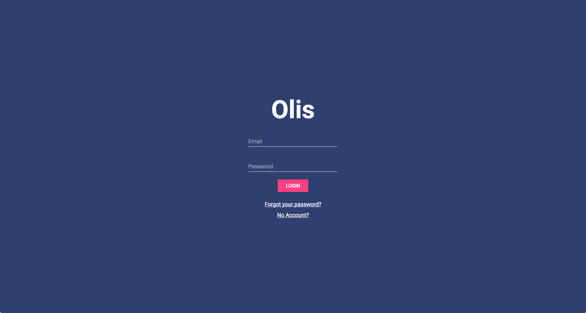
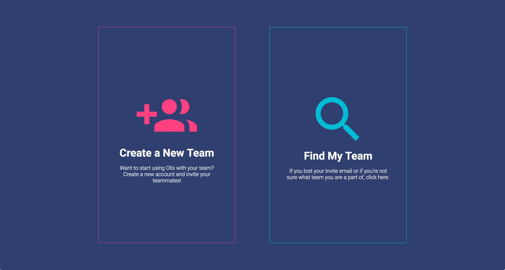
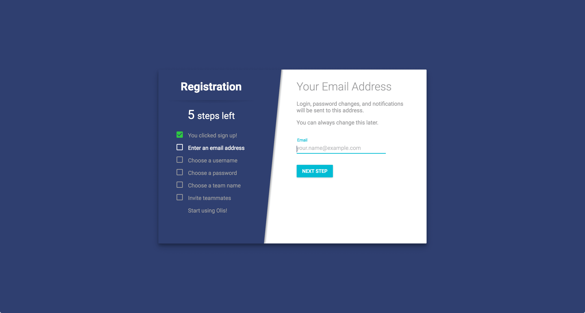
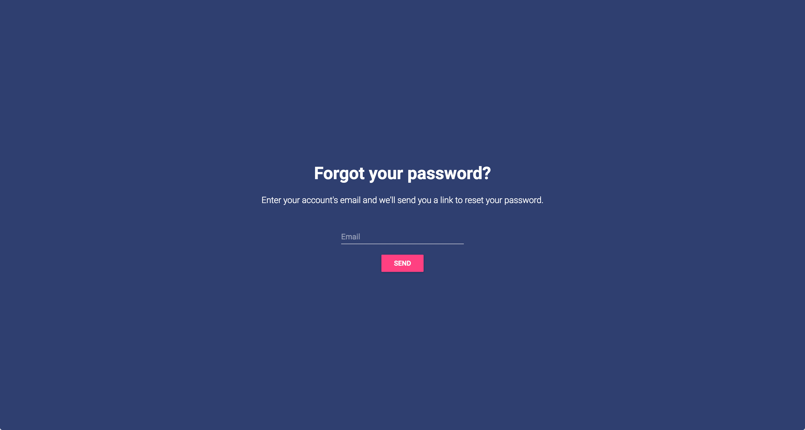
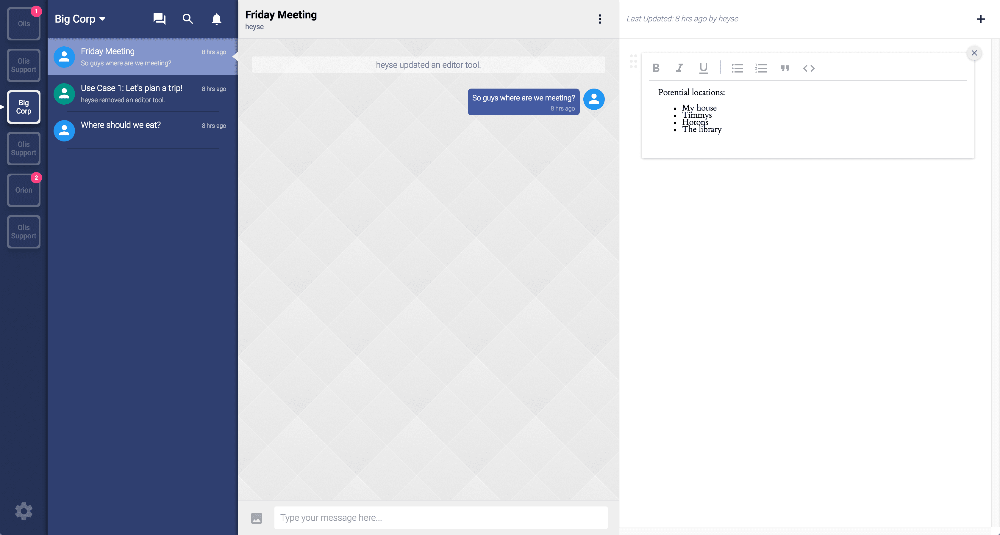
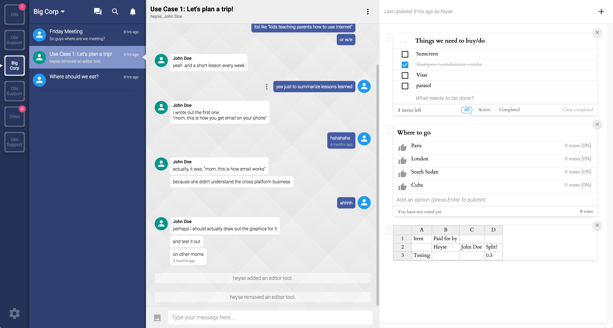
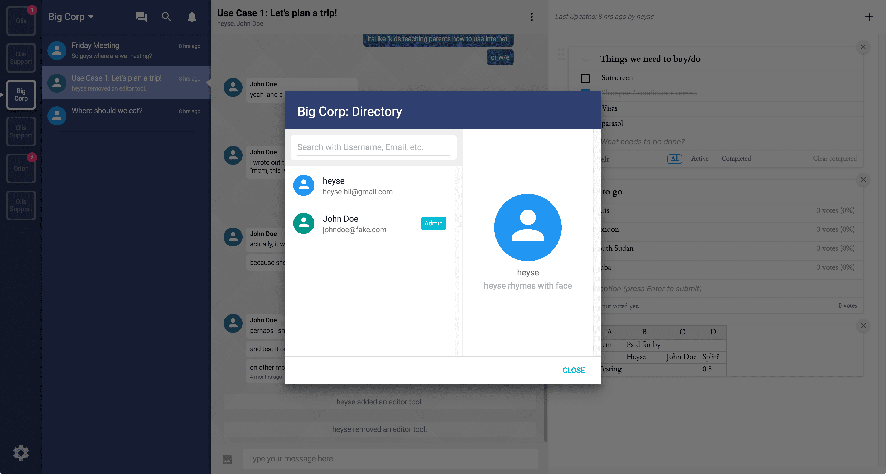
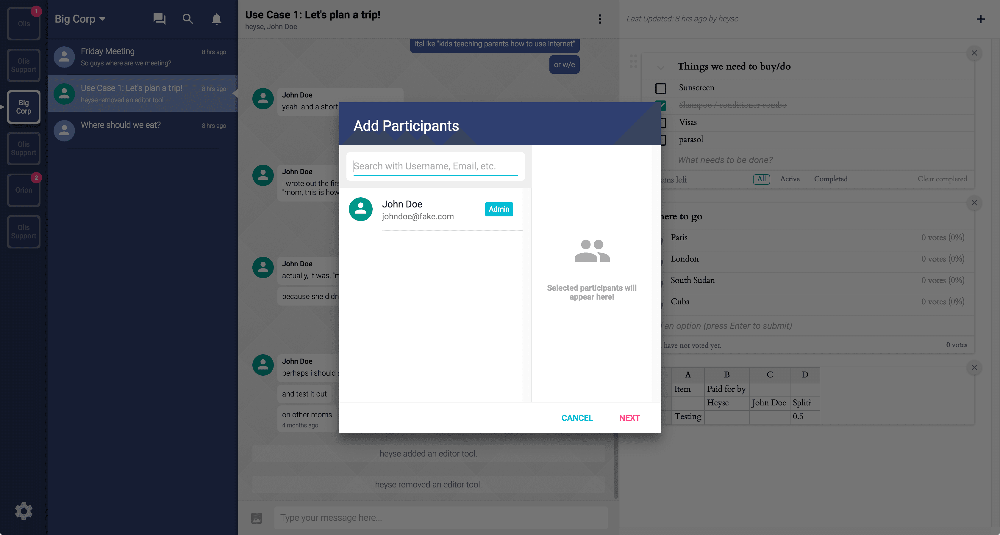

# Olis

A collaborative chat tool intended to bring persistence and focus to the traditional chat UI.

Olis was developed by [@adrianmcli](https://github.com/adrianmcli) and [@hyperh](https://github.com/hyperh) in 2016 in order to field an idea for a more organized approach to chat. The problem we were trying to solve was the frequent need to scroll up and "catch-up" on all the messages we missed while we were away from the conversation. The proposed solution was a persistent side panel where information important to the conversation can be gathered and stored for convenient and immediate reference.

## App Details

The Olis app features the following:

- Team centric collaborative chat
- Users can have multiple teams
- Persistent side panel with collaborative widgets
  - Text document widget
  - Voting widget
  - Checklist widget
  - Spreadsheet widget
- Full accounts system (including password reset and emails with invitation links)
- Multi-step onboarding system

## Tech Stack Details

The app was built on top of the following:

- [Meteor](https://www.meteor.com/) (full stack javascript framework)
- [Mantra framework](https://github.com/kadirahq/mantra) (frontend folder structure)
- [React.js](https://facebook.github.io/react/) (view library)
- [Stylus](http://stylus-lang.com/) (CSS pre-processor)
- And many more...

## Screenshots

See the screenshots directory for more.
